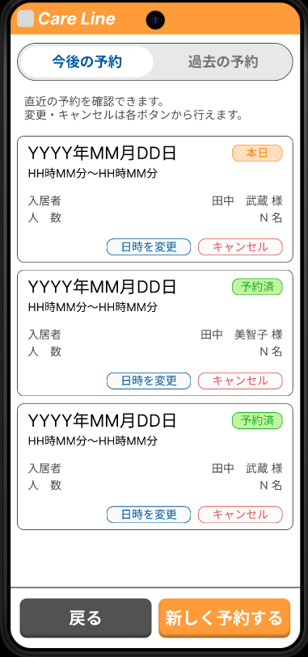
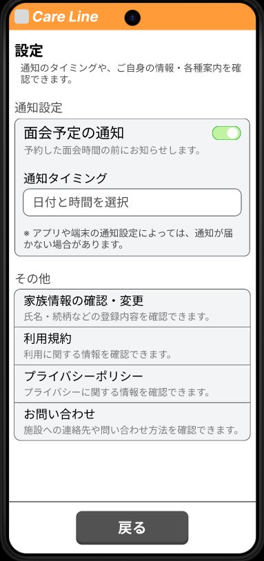

最終更新日：2026/01/18

## 💻 バイト・インターン

| 期間 | 名前 |
|:---|:---|
| 2023年（令和5年）1月～2025年（令和7年）3月 | [くろねこラボ合同会社](https://www.knlab.co.jp/) |

## 📜 資格

| 年月 | 名前 |
|:---|:---|
| 2024年（令和6年）2月 | 基本情報技術者 |
| 2024年（令和6年）12月 | ITパスポート |

## 🚀 プロジェクト
### 📌 [LCA](https://tenbou.nies.go.jp/science/description/detail.php?id=57)分析用のシミュレーションツールのプロトタイプ開発
- React (React Flow, Jotai, MUIなど)
- Python (FastAPI, NumPy, NetworkXなど)
- Docker

## 🧑‍💻 個人開発
### 📌 民間施設向け面会アプリ（2025年10月～）

  
  
  

**使用した技術**
- Python（FastAPI）
- TypeScript（React、Next.js）
- Docker
- Figma
